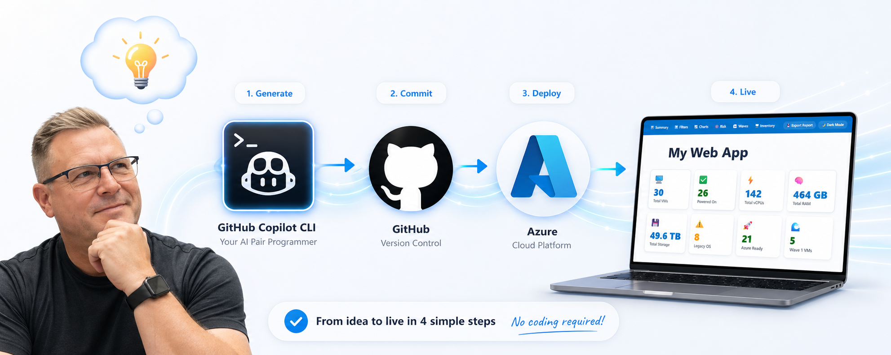

# 🛡️ NSG Rule Editor

<div align="center">
  
</div>

> **Built by a tech veteran with 30+ years of solution design expertise who has never been a professional coder — this app was vibe-crafted using [GitHub Copilot CLI](https://github.com/features/copilot/cli/) and deployed to [Azure Static Web Apps](https://azure.microsoft.com/products/app-service/static). From idea 💡 to production web app, without writing a single line of code manually.**
>
> **A visual tool for Azure network administrators to configure, analyse, and export NSG rulesets — import from BICEP, ARM, Terraform, or CSV, convert between IaC languages, detect and resolve expressions, analyse conflicts and shadows, score security compliance, simulate traffic flows, and export to 6 formats with companion parameter files.**


👉 **Try the live app here → [nsgeditor.djtools.co.nz](https://nsgeditor.djtools.co.nz/)**

📂 **Sample files to test with → [`test-samples/`](test-samples/)** — includes Bicep, ARM, Terraform, and companion parameter files

---

## 🔄 What Makes This Unique

<table>
<tr>
<td width="50%" valign="top">

### 🔀 IaC Format Conversion
Import in **any** format → Export in **any** of 6 formats. Import a Bicep file and export as Terraform — or vice versa. **4 × 6 = 24 format combinations**, powered by a universal internal rule model. Format conversion is a natural side effect — not a bolted-on feature.

</td>
<td width="50%" valign="top">

### 🧠 Expression Intelligence
Parameters, variables, and locals are **auto-detected and resolved** during import. String interpolation is handled transparently. Unresolved expressions trigger a **resolution modal** — enter values manually or drop a companion file. Original expressions **round-trip** back through export via `_expr` metadata.

</td>
</tr>
<tr>
<td width="50%" valign="top">

### 📎 Companion File Support
**Import** companion files (`.bicepparam`, `.tfvars`, `parameters.json`) to resolve parameter values during import. **Export** automatically generates companion files alongside IaC templates — ready for `az deployment` or `terraform apply`.

</td>
<td width="50%" valign="top">

### 🤖 100% No-Code Development
The entire **~4,000+ line** app was built using [GitHub Copilot CLI](https://github.com/features/copilot/cli/) with natural language prompts — no code written manually. Built by a tech veteran with **30+ years** of expertise who isn't a professional coder. Proof that **AI pair programming** produces production-quality apps.

</td>
</tr>
</table>

---

## ✨ What You Can Do

### 📂 Import

| Feature | Description |
|---------|-------------|
| **Drag & Drop** | Drop BICEP, ARM JSON, Terraform (.tf), CSV, or companion parameter files (`.bicepparam`, `.tfvars`, `parameters.json`) to load configurations or resolve expressions |
| **Smart Parsers** | Finds `Microsoft.Network/networkSecurityGroups` resources regardless of other code in the file |
| **CSV Support** | Import with quoted-field handling and semicolon-delimited multi-value fields |
| **Expression Resolution** | Parameters, variables, and string interpolation are auto-detected and resolved — drop a companion file or enter values manually |

### ✏️ Rule Management

| Feature | Description |
|---------|-------------|
| **Add, Edit, Duplicate, Delete** | Full CRUD operations with validation on every field |
| **ASG Support** | Reference Application Security Groups instead of IP addresses with a mode toggle |
| **Bulk Operations** | Toggle access/direction, delete, or renumber priorities across multiple rules |
| **Undo/Redo** | Full history with `Ctrl+Z` / `Ctrl+Y` keyboard shortcuts |
| **20+ Templates** | Pre-built rules for HTTPS, SSH, RDP, SQL, and more — one-click to add |

### 🔍 Analysis & Security

| Feature | Description |
|---------|-------------|
| **Conflict Detection** | Finds rules with overlapping criteria but opposite actions |
| **Shadow Detection** | Identifies rules that will never be evaluated |
| **Priority Gap Analysis** | Warns when rules are too close to insert between |
| **Deprecated Tag Warnings** | Flags rules using deprecated Azure service tags |
| **Security Score** | 0–100 score based on weighted heuristic checks with compliance mapping (ASB, CIS, NIST) |
| **What-If Simulator** | Test traffic flows against your ruleset — launch directly from the Security Rules toolbar or the Network Tools section |

### 📤 Export — 6 Formats

| Format | Output |
|--------|--------|
| 📘 **BICEP** | Declarative IaC template (re-importable) |
| 🟦 **Terraform** | HCL resources for `azurerm` provider (re-importable) |
| 📋 **ARM JSON** | Full ARM template with schema (re-importable) |
| 💻 **Azure CLI** | `az network nsg rule create` commands |
| ⚡ **PowerShell** | `Add-AzNetworkSecurityRuleConfig` pipeline |
| 📊 **CSV** | Tabular rule data with proper escaping |

> 💡 **Companion files:** Bicep, ARM, and Terraform exports automatically generate companion parameter files (`.bicepparam`, `parameters.json`, `.tfvars`) alongside the main template.

### 🛠️ Tools

| Feature | Description |
|---------|-------------|
| **CIDR Calculator** | Convert CIDR notation to network, broadcast, subnet mask, and host ranges (Azure-aware) |
| **Common Ports** | Searchable reference of well-known ports — click to create a rule |
| **Azure Service Tags** | Browse Microsoft's service tag catalogue — click to create a rule |
| **Diff View** | Compare original vs modified rules before exporting |
| **Audit Log** | Every action tracked with timestamps — exportable as CSV |

### 🎨 General

| Feature | Description |
|---------|-------------|
| **Dark/Light Mode** | Toggle theme or auto-detect from system preference |
| **Keyboard Shortcuts** | `Ctrl+K` command palette, `Ctrl+N` add rule, `Ctrl+E` export |
| **Zero Dependencies** | Single HTML file — no frameworks, no build step, works offline |
| **Auto-Save** | Your work is automatically saved to browser storage — resume where you left off |
| **Duplicate Detection** | Flags rules with identical traffic criteria but different priorities or access decisions |

---

## 🚀 How to Use

1. **Import or start fresh** — Drag and drop a `.bicep`, `.json`, `.tf`, or `.csv` file, or click "Start from Scratch"
2. **View & edit rules** — Rules display in Inbound/Outbound tables; click to edit, use toolbar to add/duplicate/delete
3. **Add from templates** — Browse 20+ common rule patterns and add with one click
4. **Analyse your ruleset** — Check for conflicts, shadows, gaps, and your security score
5. **Test with What-If** — Simulate traffic flows against your rules before deploying
6. **Use the tools** — CIDR Calculator, Common Ports reference, Azure Service Tags browser
7. **Export** — Choose from 6 formats, copy to clipboard or download; use Diff tab to review changes
8. **Review the audit log** — Every change is recorded with full rule-level detail, exportable as CSV

---

## 🗂️ Project Structure

```
djtools-nsg-editor/
├── index.html                    # The app (single file, zero dependencies)
├── README.md                     # This file
├── banner.png                    # Repo banner image
├── LICENSE                       # MIT license
├── SECURITY.md                   # Security reporting policy
├── docs/
│   ├── SPEC.md                   # App specification
│   ├── howitworks.md             # Technical documentation
│   └── talktrack.md              # Demo talk track
├── .github/
│   ├── ISSUE_TEMPLATE/
│   │   ├── bug_report.yml        # Structured bug report form
│   │   └── feature_request.yml   # Feature request form
│   ├── pull_request_template.md  # PR checklist template
│   └── copilot-instructions.md   # Copilot CLI context
└── .gitignore
```

---

## 🤝 Contributing

Contributions, ideas, and feedback are welcome!

1. Create a branch from `main` (`feature/`, `fix/`, or `docs/` prefix)
2. Make your changes and test locally in the browser
3. Open a Pull Request — the PR template will guide you
4. After review and approval, merge to `main` → auto-deploys to Azure

---

## 📄 License

MIT License — see [LICENSE](LICENSE) for details.

---

<div align="center">
  <strong>DJ Tools</strong> — Built with <a href="https://github.com/features/copilot/cli/">GitHub Copilot CLI</a>
</div>
